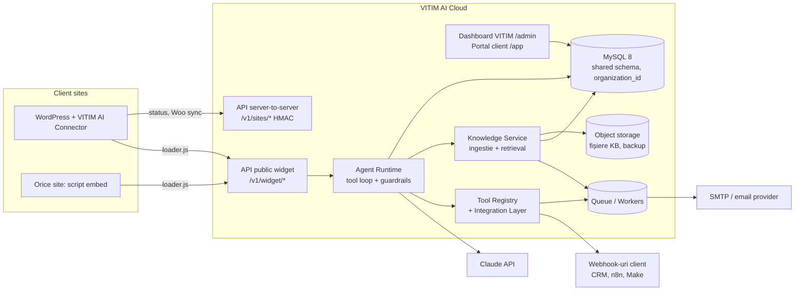
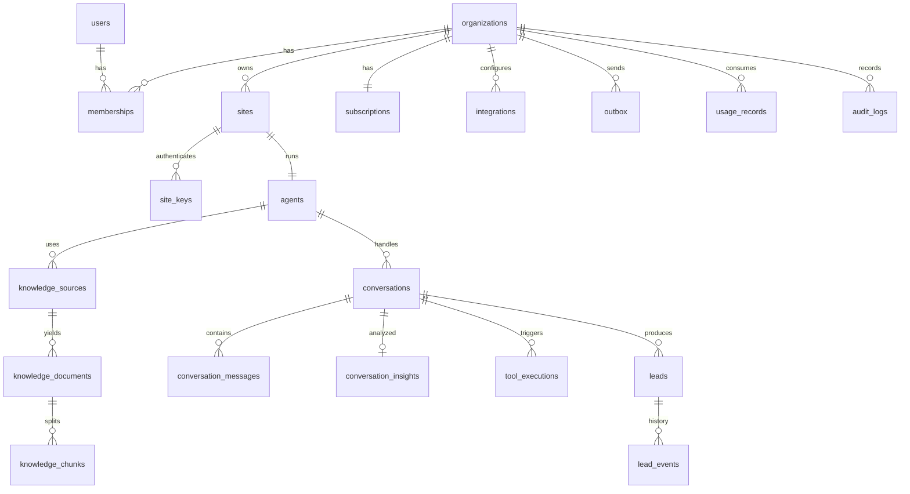

# VITIM AI Platform — Discovery & Architecture

> Status: **PROPUNERE — nu s-a implementat nimic din acest document.** Nu s-a modificat producția.
> Data auditului: 30.09.2026 · Repository: `aerodeck112/vitim` · Branch: `claude/gracious-rubin-8wnqen` · Versiune site: 1.2.1
>
> Convenții: **[DECIZIE Dn]** = are nevoie de aprobarea ta · **[NEVERIFICAT]** = ipoteză care trebuie confirmată înainte de implementare · **[ESTIMARE]** = cifră de calibrat în pilot.

---

## 1. Current State

### 1.1 Stack și structură

| Zonă | Ce există azi |
|---|---|
| Limbaj / runtime | PHP 8.1+ fără framework, ~11.800 linii proprii (fără vendor) |
| Bază de date | PDO: MySQL/MariaDB (producție, cPanel) sau SQLite (dev). Strat propriu `App\Core\DB` cu `createTable()` portabil |
| Migrări | `app/Migrations/000N_*.php`, rulate de `Migrator` (lock pe fișier), automat după update |
| Routing / MVC | `App\Core\Router`, controllere `app/Controllers/{Site,Admin}`, view-uri PHP în `app/Views` |
| Autentificare | Sesiune PHP, parole `password_hash`, TOTP 2FA, rate limit la login, roluri `admin` / `editor` / `sales` (`Auth::can()` cu hartă statică) |
| Securitate | CSRF, token de formular HMAC, honeypot, verificare same-origin, rate limit pe fișiere (`storage/ratelimit`), secrete criptate cu sodium (`Settings` cu prefix `enc:`), headere de securitate |
| API public | `POST /api/contact`, `/api/newsletter`, `/api/chat`, `GET /api/chat/{token}`, `/api/form-token` — toate same-origin, nu sunt API-uri pentru terți |
| CRM | `contacts`, `deals`, `activities`, `submissions`; pipeline Kanban; sursa lead-ului din UTM/gclid/fbclid; notificare email la lead nou; ștergere GDPR |
| Email marketing | `campaigns`, `campaign_recipients`, `campaign_links`, `email_log`; loturi prin cron HTTP; double opt-in; List-Unsubscribe |
| AI existent | `App\Core\Assistant` (307 linii) + `ChatController` + widget în `assets/js/site.js`: SDK oficial `anthropic-ai/sdk ^0.52`, model `claude-opus-5-5`, effort `low`, system prompt cu **prompt caching**, tool strict `save_lead`, buclă de tool-use (max. 4 runde), tratare `refusal` + server-side fallbacks, erori tipizate (auth / rate limit / status / conexiune), limită de ture și limită zilnică, retenție 12 luni prin cron, vizualizare conversații în panou |
| Deployment | Arhivă zip (`tools/build.php`) urcată în cPanel; updater din panou cu backup automat de cod + DB; instalator `install/` |
| Teste | Doar end-to-end Playwright (`tests/e2e.cjs`, 72 de verificări) + mock pentru API-ul AI. **Nu există teste unitare și nici lint/static analysis configurate.** |

### 1.2 Ce este reutilizabil pentru platformă

| Componentă | Reutilizare | Cum |
|---|---|---|
| Bucla agentului (`Assistant::reply`) | **Mare** | Tiparul (tool loop, prompt caching, istoric append-only, fallbacks, refusal, erori tipizate) se portează ca `AgentRuntime`, cu configurare per agent și nu din `Settings` globale |
| Tool-ul `save_lead` + `Crm::captureLead` | **Mare (ca logică)** | Devine `CreateLeadTool` în registry; validarea și regula „consimțământ explicit înainte de salvare” se păstrează |
| Widget chat (JS + CSS + markdown sigur) | **Medie** | Baza pentru widgetul embeddabil. Trebuie izolat în Shadow DOM și făcut configurabil (culori, poziție, limbă) |
| `Sanitizer`, `Mailer` (PHPMailer), criptarea cu sodium | **Medie** | Se păstrează conceptele. Criptarea devine per-tenant, cu rotație de chei |
| Rate limit, CSRF, headere | **Mică** | Pe fișiere, pentru un singur server. Platforma are nevoie de limitare centralizată (DB/Redis) și autentificare cu chei |
| CRM / newsletter | **Nu intră în platformă** | Rămân pe vitim.ro. Platforma are propriul model de lead-uri, mai simplu și multi-tenant |
| Design system (tokeni CSS, fonturi Geist, dark/light) | **Mare** | Dashboardul platformei și widgetul refolosesc tokenii: identitate unitară, fără clișee „AI” |

### 1.3 Ce trebuie păstrat neatins

- **vitim.ro** (site de prezentare + CRM + newsletter) rămâne aplicația actuală, pe cPanel. Nu se rescrie.
- Asistentul actual de pe vitim.ro funcționează până când platforma poate servi vitim.ro ca **primul tenant**. Atunci se înlocuiește widgetul, iar lead-urile continuă să ajungă în CRM-ul vitim.ro prin webhook.

### 1.4 Datorie tehnică relevantă

1. **Single-tenant peste tot**: `Settings` global, `Assistant` static. Nu se poate transforma în multi-tenant fără rescriere. De aceea platforma e o **aplicație separată**, nu o extensie a site-ului.
2. **Fără coadă de joburi**: totul rulează în request sau prin cron HTTP. Ingestia de site-uri, analiza conversațiilor și follow-up-urile au nevoie de workeri.
3. **Rate limit pe fișiere** nu funcționează pe mai multe servere.
4. **Conversațiile sunt un blob JSON** (`ai_chats.messages`): nu se pot interoga pentru analytics. Platforma are nevoie de mesaje pe rânduri.
5. **Backup-ul DB nu e automat.** Pe 30.09.2026 toate bazele de date din contul cPanel au fost șterse, iar aplicația nu avea un backup automat din care să le restaureze. Pentru o platformă cu date ale clienților, backup-ul automat în afara serverului și testul de restaurare sunt obligatorii din prima zi.
6. **Zero teste unitare**, fără PHPStan sau lint.
7. Arhivele `dist/*.zip` sunt versionate în git (~6,7 MB fiecare), ceea ce umflă repository-ul. De mutat în GitHub Releases.
8. În `.htaccess`, redirecționarea HTTPS e comentată. De verificat în producție [NEVERIFICAT].

### 1.5 Concluzia auditului

Avem un **nucleu AI funcțional și corect construit**, dar legat de un singur site. Platforma nu trebuie să pornească de la zero pe partea de AI. Trebuie însă construită **fundația multi-tenant** (izolare, chei API, joburi, RBAC, audit), care azi nu există. **Mediul cPanel nu este potrivit pentru VITIM AI Cloud** (vezi §16).

---

## 2. Proposed Architecture



**Principii**

- **Un singur backend central, multi-tenant**, cu izolare prin `organization_id` impusă în stratul de date. Nu se lasă la disciplina fiecărui controller.
- **Embed-ul JS e produsul, pluginul WP e un înveliș subțire.** Același `loader.js` servește WordPress și orice alt site, iar pluginul doar îl injectează și adaugă contextul WooCommerce.
- **Logica rămâne în cloud.** Widgetul și pluginul sunt versionate independent, iar schimbările de comportament nu cer reinstalare la client.
- **Tot ce e lent sau extern trece prin coadă**: crawling, emailuri, webhook-uri, analiza conversațiilor.

**[DECIZIE D1] Stack pentru VITIM AI Cloud.** Recomandare: aplicație nouă în **Laravel (PHP 8.3)**.
- Motiv: platforma cere exact ce oferă un framework matur (cozi și workeri, scheduler, policies/RBAC, migrări, rate limiting centralizat, autentificare cu tokeni, testare, criptare), iar echipa și codul AI existent sunt deja în PHP. Refacerea acestor piese în nucleul propriu ar însemna mii de linii de infrastructură de întreținut.
- Alternativa: extinderea nucleului propriu. Mai puține dependențe, dar izolarea tenanților, cozile și RBAC-ul ar fi scrise și testate de mână. Nu o recomand pentru date ale sute de clienți.

---

## 3. System Components

| Componentă | Responsabilitate | MVP? |
|---|---|---|
| **Tenant Core** | Organizații, site-uri, utilizatori, membership și roluri, chei de site, `TenantContext` | Da |
| **Widget API** | Sesiuni de chat anonime, trimitere mesaj, istoric, verificare origin, rate limit per site/IP | Da |
| **Agent Runtime** | Construiește promptul (instrucțiuni + fapte de bază + context recuperat), rulează bucla de tool-use, aplică guardrail-uri, înregistrează consumul | Da |
| **Tool Registry** | Tool-uri modulare, cu schemă strictă, permisiuni și execuție auditată | Da (3–4 tool-uri) |
| **Knowledge Service** | Surse → documente → fragmente; crawl de sitemap, text manual, FAQ; căutare | Da (fără PDF, fără Woo) |
| **Lead Engine** | Lead-uri, evenimente, rezumat, notificări | Da |
| **Notification Outbox** | Livrare garantată: email, apoi webhook | Da (email + webhook) |
| **Insights (post-conversație)** | Intenție, rezumat, întrebări fără răspuns, servicii/produse cerute, prin Batch API | Da (simplu) |
| **Dashboard VITIM** | Clienți, status, consum, conversații, lead-uri, loguri | Da |
| **Portal client** | Rapoarte de business, conversații, lead-uri | Da (read-only) |
| **Integration Layer** | Webhook generic → n8n/Make/CRM; apoi Google Calendar, Sheets, Woo, WhatsApp | Webhook: Da; restul: Faza 2–3 |
| **Follow-up Engine** | Secvențe configurabile cu consimțământ și opt-out | Faza 2 |
| **Human Handoff live** | Mod AI/HUMAN, preluare de către operator | Faza 2 (în MVP: handoff prin notificare) |
| **Billing** | Planuri, limite, status abonament, fără procesator de plăți | Faza 2 (în MVP: plan + limite hard) |
| **Demo Generator** | Agent demo din URL public | Faza 3, după aprobarea analizei din §17 |

---

## 4. Multi-Tenant Model

- **Model de date: bază comună, schemă comună, coloana `organization_id` pe fiecare tabel cu date de client.**
  - Alternativele (bază separată per client, schemă per client) înmulțesc migrările și backup-urile de sute de ori, fără beneficii reale la volumul țintit.
- **Impunerea izolării**, pe patru niveluri:
  1. `TenantContext` se setează o singură dată per request, din sesiunea utilizatorului, din cheia de site (widget) sau din semnătura HMAC (plugin). **Niciodată** din parametri trimiși de client sau de model.
  2. Un global scope pe toate modelele tenant filtrează automat după `organization_id`. Interogările fără scope sunt permise doar în cod de platformă marcat explicit (ex. rapoarte agregate pentru admin VITIM).
  3. Chei compuse și FK-uri acolo unde e posibil (`(organization_id, id)`), ca un rând să nu poată fi legat de alt tenant.
  4. **Teste automate de izolare** pentru fiecare endpoint: un user din org A primește 404 pe resursele din org B, iar o cheie de site din org A nu poate citi conversații din org B.
- **Tool-urile nu primesc niciodată `organization_id` de la model.** Contextul e injectat de runtime.
- Cache-urile, fișierele și căile din object storage sunt prefixate cu `org/{id}/`.

---

## 5. Database Schema

Analiza entităților propuse (§22 din brief):

| Entitate | Decizie | Motiv |
|---|---|---|
| organizations, sites, agents, users | **Păstrat** | Fundația |
| roles | **Înlocuit** cu `memberships.role` (enum) | Rolurile sunt fixe și definite în cod. Un tabel de roluri configurabile e overengineering acum |
| knowledge_sources, knowledge_documents, knowledge_chunks | **Păstrat** | Separarea sursă → document → fragment permite reindexare incrementală |
| conversations, conversation_messages | **Păstrat** | Mesaje pe rânduri, pentru analytics și handoff |
| visitors | **Amânat** | În MVP ajunge un `visitor_key` (hash anonim) pe conversație. Tabel separat doar când apare identificarea cross-sesiune |
| leads, lead_events | **Păstrat** | `lead_events` = istoric (creat, notificat, contactat, câștigat) |
| actions | **Eliminat** | Catalogul de acțiuni e cod (Tool Registry). Configurarea per agent stă în `agents.tools` (JSON) |
| action_executions | **Păstrat** (ca `tool_executions`) | Audit și depanare pentru fiecare apel de tool |
| integrations + integration_credentials | **Comasat** în `integrations` cu `credentials_enc` | Un set de credențiale per integrare în MVP; se separă la nevoie de rotație sau mai multe conturi |
| appointments | **Faza 2** | Depinde de integrarea cu calendarul |
| notifications | **Păstrat** (ca `outbox`) | Livrare garantată, cu reîncercări, pentru email și webhook |
| usage_records | **Păstrat** | Cost, limite, facturare. Agregare zilnică + detaliu pe mesaj |
| subscriptions | **Păstrat, minimal** | Plan, status, limite. Fără procesator de plăți |
| audit_logs | **Păstrat** | Obligatoriu pentru securitate și GDPR |
| **Nou:** `conversation_insights` | Adăugat | Rezultatul analizei post-conversație (intenții, rezumat, întrebări fără răspuns) |
| **Nou:** `site_keys` | Adăugat | Cheie publică pentru widget + secret pentru server-to-server, cu rotație |



Coloane esențiale (tipurile și indexurile se finalizează la implementare):

```
organizations      id, name, slug, status(active|suspended), locale, timezone, data_retention_days, created_at
users              id, email (unic), name, password_hash, totp_secret_enc, platform_role(null|platform_admin|platform_support), last_login_at
memberships        id, organization_id, user_id, role(owner|manager|operator|viewer)                      UNIQUE(org,user)
subscriptions      id, organization_id, plan(start|pro|business|enterprise), status(trial|active|past_due|suspended|cancelled),
                   limits_json, trial_ends_at, current_period_start, current_period_end
sites              id, organization_id, domain, allowed_origins_json, platform(wordpress|generic), connector_version, last_seen_at, status
site_keys          id, organization_id, site_id, public_key (pk_…), secret_hash, secret_enc, revoked_at
agents             id, organization_id, site_id, name, template(generic|auto|clinic|ecommerce), languages_json,
                   instructions, core_facts, lead_fields_json, tools_json, model, effort, widget_json, status(draft|live|paused), version
knowledge_sources  id, organization_id, agent_id, type(sitemap|url_list|manual|faq|file|woocommerce), config_json,
                   status, last_run_at, last_error
knowledge_documents id, organization_id, source_id, url|title, content_hash, tokens, fetched_at, status(active|excluded)
knowledge_chunks   id, organization_id, document_id, ord, heading, text, tokens          FULLTEXT(heading,text)
conversations      id, organization_id, agent_id, site_id, public_token, visitor_key, locale, page_url,
                   mode(ai|human_requested|human), status(open|closed), turns, started_at, last_message_at
conversation_messages id, organization_id, conversation_id, role(user|assistant|tool|operator|system),
                   content_text, raw_json, input_tokens, output_tokens, cache_read_tokens, cache_write_tokens, latency_ms, model
conversation_insights id, organization_id, conversation_id, intents_json, primary_intent, summary, unanswered_json,
                   topics_json, lead_score, analyzed_at, model
tool_executions    id, organization_id, conversation_id, tool, input_json, result_json, status(ok|denied|error), duration_ms
leads              id, organization_id, agent_id, conversation_id, intent, name, phone, email, company,
                   requested_service, product, budget, preferred_date, notes, summary, next_action,
                   consent_at, consent_text_version, status(new|notified|contacted|won|lost), created_at
lead_events        id, organization_id, lead_id, type, payload_json, actor_user_id, created_at
integrations       id, organization_id, type(webhook|email|woocommerce|gcal|gsheets|whatsapp|…), config_json, credentials_enc, status
outbox             id, organization_id, channel(email|webhook), payload_json, status, attempts, next_attempt_at, last_error
usage_records      id, organization_id, agent_id, day, conversations, messages, input_tokens, output_tokens,
                   cache_read_tokens, cache_write_tokens, cost_micros                    UNIQUE(org,agent,day)
audit_logs         id, organization_id|null, actor_user_id|null, actor_type, action, target_type, target_id, ip, meta_json, created_at
```

---

## 6. API Architecture

Trei suprafețe de API, cu autentificări diferite:

| Suprafață | Consumator | Autentificare | Exemple |
|---|---|---|---|
| **Widget API** `/v1/widget/*` | Browserul vizitatorului | `public_key` al site-ului (nu e secret) + verificarea `Origin` față de `allowed_origins` + token de conversație (aleator, 128 biți) + rate limit | `POST /v1/widget/sessions`, `POST /v1/widget/conversations/{token}/messages`, `GET /v1/widget/conversations/{token}`, `GET /v1/widget/config` |
| **Site API** `/v1/sites/*` | Pluginul WP sau alt server | Semnătură HMAC-SHA256 (`key_id`, `timestamp`, `nonce`, corp), fereastră de 5 minute, anti-replay | `POST /v1/sites/connect`, `POST /v1/sites/heartbeat`, `POST /v1/sites/catalog` (Faza 3) |
| **App API** (intern) | Dashboard și portal | Sesiune + CSRF + 2FA pentru rolurile de platformă | CRUD-urile din dashboard |

- **Contracte**: JSON, versionate în URL (`/v1`), erori uniforme `{error: {code, message}}`, validare strictă a intrării. Specificație OpenAPI pentru Widget API și Site API.
- **Webhook-uri ieșite** (spre CRM, n8n, Make): semnate `X-Vitim-Signature` (HMAC cu secret per integrare), trimise prin outbox cu reîncercări exponențiale.
- **Limitare**: `public_key` e vizibil în pagină, deci protecția reală vine din limite: mesaje per IP, per conversație și per zi per site, plus plafonul de consum al abonamentului (§15).

---

## 7. Agent Architecture

```
Mesaj vizitator
  → Guard: validare, lungime, rate limit, plan activ, plafon de consum
  → ContextBuilder:
        [cached] instrucțiuni platformă (reguli, anti-injection, format)
        [cached] instrucțiuni agent + „core facts” (firmă, contact, program, politici)
        [cached] definiții tool-uri (ordine deterministă)
        [dinamic] fragmente recuperate din Knowledge (ca documente/rezultate de căutare, cu sursă)
        [append-only] istoricul conversației
  → Claude API (Messages API, tool use, prompt caching, fallbacks)
  → Tool loop (max. N runde): autorizare → execuție → tool_execution log
  → Răspuns + înregistrare consum (tokeni, latență, cost)
  → La închidere (inactivitate 30 min): job Insights (Batch API)
```

- **Model**: implicit `claude-opus-5-5` (cel folosit deja), effort `low` pentru chat. La acest model gândirea nu poate fi dezactivată, iar effort-ul e pârghia de cost. Modelul și effort-ul sunt câmpuri per agent. **[DECIZIE D4]** Pentru un plan ieftin ar putea fi folosit alt model (ex. `claude-sonnet-5-5` sau `claude-haiku-4-5`), dar doar după evaluare pe conversații reale, nu doar pe criteriul de cost.
- **Prompt caching**: prefixul stabil (tool-uri + instrucțiuni + core facts) e marcat pentru cache. Cache-ul e izolat per workspace Anthropic și nu se amestecă între organizațiile Anthropic. Între tenanții noștri prefixele diferă oricum prin conținut. Verificare continuă prin `cache_read_input_tokens` în `usage_records`.
- **Istoric append-only**: istoricul nu se rescrie. Cu thinking mereu activ, blocurile de raționament se retrimit neschimbate. E tiparul folosit deja în `Assistant::toApi()`.
- **Guardrails**:
  - răspunde doar din Knowledge și core facts;
  - dacă informația lipsește, spune asta și oferă preluarea datelor sau un om;
  - fără prețuri inventate;
  - reguli de verticală (ex. clinică: fără diagnostice);
  - operatorul (firma client) comunică prin mesaje de sistem, iar textul vizitatorului e tratat ca simplu mesaj.
- **Intenția**: în timp real, doar când contează pentru acțiune (tool-ul `create_lead` primește `intent`, care poate fi `BUY_INTENT`, `QUOTE_REQUEST`, `APPOINTMENT`, `SUPPORT`, `PRODUCT_INFORMATION`, `COMPLAINT`, `HUMAN_REQUEST` sau `OTHER`). Clasificarea completă pentru analytics se face **după** conversație, asincron, prin Batch API (cost ~50% mai mic). Așa nu mai e nevoie de un apel suplimentar la fiecare mesaj.
- **Multilingv**: agentul răspunde în limba vizitatorului. Knowledge-ul poate rămâne în română.
- **Refuzuri și erori**: se păstrează tratarea existentă (refusal → mesaj politicos + telefon; erori API → mesaj offline, fără a pierde conversația).
- **De ce nu Managed Agents**: nu avem nevoie de container per sesiune. O conversație de chat e o buclă scurtă de tool-use, cu tool-uri executate la noi, sub controlul nostru de acces.

---

## 8. Knowledge / RAG Architecture

**Ingestie** (joburi în coadă):
1. Sursa `sitemap` sau `url_list` se limitează la domeniul verificat al site-ului. Se respectă `robots.txt`, se aplică un plafon de pagini per plan și se exclud tiparele de URL alese de client (coș, cont, căutare).
2. Se extrage textul principal: fără meniu și footer, cu titluri păstrate. Se calculează `content_hash`, ca paginile neschimbate să nu fie reindexate.
3. Textul se împarte în fragmente de ~400–800 de tokeni, pe titluri, cu metadate: URL, titlu, secțiune.
4. Sursele `manual` și `faq` se editează din dashboard. PDF/DOCX intră în Faza 3, iar catalogul WooCommerce în Faza 5.
5. Clientul poate exclude documente și vede ce „știe” agentul. Principiul e „informații aprobate”.

**Recuperare, strategia MVP [DECIZIE D5]:**
- **Core facts** (firmă, contact, program, zone, politici cheie; câteva mii de tokeni) sunt **mereu** în promptul cache-uit.
- **Căutare lexicală MySQL FULLTEXT** pe fragmente, top 5–8, filtrată pe `organization_id` și `agent_id`. Nu adaugă dependențe și e suficientă pentru site-uri de firme mici, cu vocabular specific (ex. „distribuție”, „Ford Kuga”).
- **Varianta „context complet”**: dacă tot knowledge-ul unui agent e mic (sub un prag de tokeni de calibrat), se pune integral în prefixul cache-uit, fără retrieval. Calitate mai bună, cost acceptabil datorită cache-ului. Pragul se alege după măsurători [ESTIMARE].
- **Embeddings (Faza 3)**: API-ul Claude nu oferă embeddings. Ar fi nevoie de un furnizor separat și de un index vectorial (MySQL cu suport vectorial sau un serviciu dedicat). Se introduc doar dacă evaluarea arată că recuperarea lexicală ratează întrebări reale.

**Reducerea halucinațiilor:**
- Fragmentele recuperate se trimit ca blocuri de document sau rezultate de căutare cu **citări**, astfel că răspunsul e legat de surse. Dashboardul arată pe ce s-a bazat fiecare răspuns. Sintaxa PHP exactă (search result blocks / citations) trebuie verificată în SDK-ul 0.52 [NEVERIFICAT].
- Regulă explicită: fără sursă nu există afirmație factuală despre firmă. Întrebarea se marchează „fără răspuns” și alimentează raportul de oportunități.
- **Set de evaluare** per verticală: 30–50 de întrebări reale, cu răspuns așteptat. Se rulează la fiecare schimbare de prompt sau de strategie de recuperare.

---

## 9. Actions / Tools Architecture

```php
interface Tool {
    public function name(): string;                  // ex. "create_lead"
    public function definition(AgentConfig $a): array; // descriere + JSON Schema strict (additionalProperties:false)
    public function authorize(ToolContext $ctx): bool;  // tenant, plan, integrare configurată, mod conversație
    public function handle(ToolContext $ctx, array $input): ToolResult; // validare suplimentară + efect
}
```

- `ToolRegistry` conține catalogul (cod). Fiecare agent activează un subset (`agents.tools`). Tool-urile noi se adaugă ca clase noi, fără schimbări în runtime.
- `ToolContext` conține `organization_id`, `agent`, `conversation`, `site`, injectate de server. **Modelul nu poate alege tenantul, destinatarul emailului sau URL-ul webhook-ului**: acestea vin din configurare.
- Fiecare apel se scrie în `tool_executions`: input, rezultat, status, durată. Tool-urile cu efect extern (email, webhook) **pun în outbox**, nu trimit sincron.
- Schemele sunt **stricte**, pentru argumente valide garantat. Pe modelul actual, tool-ul nu poate fi forțat, deci promptul și schema ghidează apelul (aceeași abordare ca azi).

| Tool | Faza | Efect |
|---|---|---|
| `create_lead` | MVP | Lead + eveniment + notificare (outbox). Necesită consimțământ explicit |
| `request_human` (handoff) | MVP | `mode=human_requested`, notificare urgentă, colectare contact |
| `search_knowledge` | MVP (opțional) | Permite modelului o a doua căutare când prima n-a ajuns |
| `send_webhook` (intern, după lead) | MVP | Livrare către CRM/n8n/Make a clientului |
| `create_quote_request` | Faza 2 | Variantă de lead cu câmpuri de ofertă |
| `create_appointment` | Faza 2 | Google Calendar (disponibilitate + rezervare) |
| `search_products`, `get_product`, `check_stock` | Faza 3 | WooCommerce, prin connector |
| `get_order_status` | Faza 3 | WooCommerce, cu verificarea identității clientului |
| `send_whatsapp` | Faza 3 | WhatsApp Business API (șabloane aprobate de Meta) |
| `create_support_ticket` | Faza 3 | Integrare helpdesk/email |

---

## 10. Integrations

- **Integration Layer**: interfață `Integration` (config + credentiale criptate + `test()` + capabilități) și tool-uri care o folosesc. Credențialele sunt criptate cu o cheie de aplicație, nu se afișează niciodată după salvare și nu ajung în loguri sau în prompt.
- **Ordinea**:
  1. Email (notificări).
  2. **Webhook generic semnat**. Acoperă n8n, Make, CRM-uri și ERP-uri prin automatizări, fără integrări native.
  3. Google Calendar.
  4. Google Sheets.
  5. WooCommerce.
  6. WhatsApp.
  7. Integrări native cerute de minimum 20 de clienți.
- Regula de produs (§25) se aplică strict: integrare nativă doar când webhook-ul nu ajunge și sunt cel puțin 20 de clienți interesați.

---

## 11. WordPress Connector

Plugin **„VITIM AI Connector”**, cu țintă sub ~500 de linii PHP:

| Funcție | Implementare |
|---|---|
| Conectare | Clientul lipește un **cod de conectare** de unică folosință, generat în dashboard. Pluginul face `POST /v1/sites/connect` și primește `site_id`, `public_key` și `secret`, salvate în `wp_options`. Secretul nu se mai afișează |
| Widget | `wp_enqueue_script` pentru `https://<cloud>/widget/v1/loader.js`, cu `data-site=pk_…`. Toată interfața vine din cloud |
| Context | Tipul paginii, ID-ul produsului sau categoriei (Woo), limba. Fără date personale ale utilizatorului WP |
| Status | Heartbeat zilnic prin WP-Cron: versiune plugin, WP, PHP, Woo, domeniu. Vizibil în dashboard |
| WooCommerce (Faza 5) | Endpoint REST în plugin, **read-only**, semnat HMAC de cloud: căutare produse, produs, stoc, status comandă (cu verificare email + nr. comandă) |
| Update-uri | Logica fiind în cloud, pluginul se schimbă rar. Update-urile vin prin serverul de update al VITIM (filtrul standard de update WP), fără reinstalare |
| Dezinstalare | Șterge opțiunile și revocă cheia în cloud |

Site-urile non-WordPress folosesc **același** snippet: `<script src=".../loader.js" data-site="pk_…" async></script>`.

---

## 12. Authentication & RBAC

| Rol | Nivel | Poate |
|---|---|---|
| `platform_admin` | VITIM | Tot: clienți, planuri, suspendare, impersonare (auditată) |
| `platform_support` | VITIM | Citire, depanare, impersonare cu motiv obligatoriu (auditată) |
| `owner` | Client | Tot în organizația lui, inclusiv utilizatori și integrări |
| `manager` | Client | Agent, knowledge, lead-uri, rapoarte |
| `operator` | Client | Conversații, handoff, lead-uri |
| `viewer` | Client | Rapoarte |

- 2FA (TOTP, deja implementat pe site) **obligatoriu** pentru rolurile de platformă.
- Autorizarea se face prin policies centrale per resursă, nu cu `if`-uri împrăștiate prin controllere.

---

## 13. Security

| Risc | Măsură |
|---|---|
| Acces între tenanți | §4: context unic, global scope, teste de izolare obligatorii în CI |
| Abuz de widget / consum AI | Rate limit (IP, conversație, site, zi), plafon lunar de cost per organizație, lungime maximă de mesaj și de ture, blocare automată la anomalii |
| Prompt injection (vizitator sau conținut indexat) | Conținutul indexat e tratat ca date (documente cu sursă), nu ca instrucțiuni. Tool-urile nu primesc parametri sensibili de la model (destinatari, URL-uri, tenant). Autorizare server-side pe fiecare tool. Instrucțiunile de operator vin prin canalul de sistem. Linkurile din răspuns sunt limitate la domeniile clientului |
| Chei și secrete | Secrete de site stocate ca hash (+ criptat pentru HMAC), rotație din dashboard. Credențiale de integrare criptate. Cheia API Claude doar în mediu de server, niciodată în DB-ul tenanților |
| Webhook-uri | HMAC + timestamp + anti-replay, atât pe intrare, cât și pe ieșire |
| Input | Validare strictă pe toate API-urile, limite de mărime, sanitizare la afișarea în dashboard |
| SSRF (crawler, webhook) | Doar http/https pe porturile 80/443. Se rezolvă DNS-ul și se blochează IP-urile private, loopback și metadata. Timeout-uri, limită de mărime, maximum 3 redirecționări |
| Audit | `audit_logs` pentru autentificări, schimbări de configurare, exporturi, ștergeri, impersonări |
| Date personale în loguri | Logurile tehnice nu conțin conținutul mesajelor sau datele lead-urilor |

---

## 14. Analytics

- **Surse**: `conversation_messages` (volum, latență, tokeni), `tool_executions`, `leads`, `conversation_insights` (intenții, întrebări fără răspuns, subiecte), `usage_records` (cost).
- **Agregare** zilnică într-un job, ca dashboardul să nu calculeze din date brute.
- **Metrici de business pentru client**:
  - conversații, lead-uri, rata de conversie, cereri de ofertă, programări, handoff-uri;
  - top intenții, top întrebări, întrebări fără răspuns („oportunități”), servicii și produse cerute;
  - **ore estimate economisite** = conversații × minute medii per conversație umană. Coeficientul e configurabil și se afișează explicit ca estimare.
- **Metrici tehnice pentru VITIM**: tokeni, cache hit rate, cost, latență p50/p95, erori, refuzuri.
- **ROI**: lead-urile marcate „câștigat” de client (cu valoare opțională) comparate cu costul abonamentului.

---

## 15. Billing

- În MVP: `subscriptions` cu `plan`, `status` (`trial | active | past_due | suspended | cancelled`) și `limits_json`.
- Limitele: conversații/lună, plafon de cost AI/lună, documente knowledge, pagini indexate, agenți, utilizatori, retenție analytics, integrări.
- **Aplicare**:
  - **soft** la 80% (notificare);
  - **hard** la 100% (widgetul afișează contactul firmei în loc de chat), cu opțiunea de overage per plan.
- **Fără procesator de plăți** până nu e stabilită arhitectura. Facturarea se face manual, din rapoartele de consum.
- Planurile START / PRO / BUSINESS / ENTERPRISE se definesc în configurare, nu în cod. Prețurile se stabilesc **după pilot**, pe baza costului măsurat per conversație (§21).

---

## 16. Deployment

**[DECIZIE D2] VITIM AI Cloud nu se instalează pe cPanel.** Motive:
- are nevoie de workeri permanenți (coadă) și scheduler;
- joburile de crawl rulează minute întregi;
- cere backup automat verificabil (cPanel tocmai a pierdut toate bazele de date);
- izolarea și monitorizarea sunt slabe pe shared hosting;
- limitele de timp PHP afectează apelurile AI lungi.

Recomandare:
- **MVP**: un VPS în UE (4 vCPU / 8 GB), cu Nginx + PHP-FPM 8.3, MySQL 8, Redis (coadă + rate limit) și supervisor pentru workeri. Domeniu dedicat [DECIZIE D3], de exemplu `ai.vitim.ro`. Deploy din git cu migrări automate, zero-downtime (symlink de release).
- **Scalare**, peste ~100 de clienți activi [ESTIMARE]: aplicație și workeri separați, MySQL gestionat cu replică, Redis gestionat, CDN pentru `loader.js`.
- **Mediile**: `local` → `staging` (date fictive) → `production`. Secretele stau în variabile de mediu, niciodată în git.

---

## 17. Monitoring

- Uptime extern pe `/health`: DB, Redis, coadă, vârsta ultimului heartbeat al workerului.
- Erori de aplicație centralizate, cu alertă pe email.
- Alerte:
  - coada blocată peste 5 minute;
  - rata de erori ale API-ului AI peste prag;
  - cost zilnic per organizație peste prag;
  - cache hit rate prăbușit;
  - site-uri fără heartbeat de 7 zile.
- Dashboardul VITIM afișează statusul agenților: `online` = widget încărcat recent și ultimul răspuns AI reușit.

---

## 18. Backup

- Dump MySQL complet zilnic, **criptat, copiat în afara serverului** (alt furnizor sau altă regiune), cu retenție 30 de zile. Binlog pentru restaurare la un moment dat.
- Object storage (fișiere knowledge) replicat.
- **Test de restaurare lunar, documentat.** Un backup nerestaurat nu e backup. Incidentul din 30.09.2026 arată de ce.
- Separat, pentru vitim.ro, se recomandă imediat backup automat zilnic al bazei de date, trimis în afara cPanel-ului. E o schimbare mică în aplicația existentă, propusă separat.

---

## 19. GDPR

- **Roluri**: clientul VITIM e **operator**, VITIM e **persoană împuternicită**, iar furnizorii (Anthropic pentru AI, hostingul, emailul) sunt **sub-împuterniciți**. Contract DPA-tip pentru clienți și lista sub-împuterniciților publică.
- **Transparență**: widgetul afișează la prima deschidere un mesaj scurt („asistent virtual; conversația e procesată de…”) cu link spre politica clientului.
- **Consimțământ**: lead-ul se salvează doar după acord explicit (regula existentă), cu `consent_at` și versiunea textului.
- **Retenție** per organizație (implicit 12 luni pentru conversații), aplicată de job.
- **Drepturi**: export și ștergere per conversație, lead sau email, din dashboard, cu audit.
- **Localizarea datelor**: DB-ul în UE. Pentru procesarea AI, verificăm opțiunile de geografie ale API-ului (există parametrul `inference_geo`; regiunile disponibile pentru UE trebuie confirmate) [NEVERIFICAT]. Documentăm transferul în DPA.
- Follow-up-urile (Faza 2) necesită consimțământ separat pentru marketing, opt-out în fiecare mesaj, ore liniștite și plafon de mesaje.

---

## 20. Risks

| Risc | Impact | Atenuare |
|---|---|---|
| Scurgere de date între tenanți | Critic | §4 + teste de izolare obligatorii, review de securitate înainte de producție |
| Halucinații (prețuri, promisiuni) | Mare, reputațional | Core facts + citări + regula „fără sursă, fără afirmație” + set de evaluare |
| Cost AI peste prețul abonamentului | Mare | Plafoane per organizație, măsurare din prima zi, prețuri stabilite după pilot |
| Abuz de widget (boți, consum) | Mediu | Rate limit multinivel, plafon lunar, blocare automată |
| Calitate slabă a recuperării lexicale | Mediu | Varianta „context complet” pentru knowledge mic; embeddings în Faza 3 dacă evaluarea o cere |
| Scope creep (30 de integrări) | Mare | MVP strict (§22), regula celor 20 de clienți |
| Dependență de un singur furnizor AI | Mediu | Runtime-ul izolează apelul la model într-o singură clasă; fallback-uri server-side deja active |
| Operare (on-call, incidente) | Mediu | Monitorizare, runbook, backup testat |
| Juridic (GDPR, date medicale la clinici) | Mare pe verticala medicală | Guardrail „fără diagnostic”, fără colectare de date medicale în lead, DPA |
| Echipă mică, întreținere | Mediu | Framework standard, teste, fără abstracții inutile |

---

## 21. Estimated infrastructure requirements

| Element | MVP (≤ 30 clienți) [ESTIMARE] |
|---|---|
| Server | 1 VPS UE, 4 vCPU / 8 GB / 160 GB SSD |
| Backup offsite | Storage S3-compatibil, ~50–100 GB |
| Email tranzacțional | Furnizor SMTP cu reputație bună (notificări) |
| Monitorizare | Uptime extern + colectare erori |

**Cost AI per conversație** [ESTIMARE, de măsurat în pilot]. Model `claude-opus-5-5` la $4 / $20 per milion de tokeni input/output; citire din cache $0,20/MTok, scriere în cache 1,25× pentru TTL de 5 minute.

- Tipar: ~5 ture; ~3–6k tokeni de prefix cache-uit; ~3–4k tokeni de context recuperat plus istoric necache-uit per tură; ~300–500 tokeni de ieșire per tură.
- Rezultat: **~$0,10–0,20 per conversație**, plus prima scriere în cache la fiecare conversație izolată în timp. Pentru 400 de conversații/lună la un client, **~$40–80/lună costuri AI**.
- Analiza post-conversație prin Batch API adaugă puțin (reducere ~50% față de apelurile sincrone).
- Aceste cifre determină prețul planurilor. **Nu se stabilesc prețuri înainte de măsurare.**

---

## 22. MVP Scope

**Inclus:**
1. Tenant Core: organizații, site-uri, utilizatori, roluri, chei de site, audit.
2. Dashboard VITIM: listă de clienți cu status, conversații, lead-uri, cost; pagină per client cu Overview / Agent / Knowledge / Conversations / Leads / Usage / Settings / Logs.
3. Configurare agent: instrucțiuni, core facts, câmpuri de lead, template de verticală, limbă, aspect widget.
4. Knowledge: sitemap/listă de URL-uri (crawl în coadă), text manual, FAQ; căutare FULLTEXT; vizualizarea și excluderea documentelor.
5. Agent Runtime cu tool-urile `create_lead`, `request_human` și `search_knowledge` (opțional).
6. Widget embeddabil (Shadow DOM, responsive, dark/light, fără clișee „AI”).
7. Plugin WordPress (conectare, widget, heartbeat). Fără WooCommerce.
8. Lead-uri cu rezumat, notificare email și webhook semnat.
9. Insights post-conversație (intenție, rezumat, întrebări fără răspuns) + analytics de bază.
10. Portal client read-only: conversații, lead-uri, raport lunar.
11. Securitate: izolare testată, rate limit, plafon de cost, backup automat offsite, monitorizare.

**Exclus din MVP:**
- handoff live (în MVP handoff-ul înseamnă notificare + colectare de contact);
- follow-up automat;
- WhatsApp, calendar, WooCommerce, PDF/DOCX, embeddings;
- billing cu plăți;
- demo generator;
- CRM/ERP nativ.

**Criteriul de reușită**: fluxul „DEMO AUTO SRL” din brief (§24), rulat end-to-end pe staging, cu un site WordPress de test. Același flux devine test automat.

---

## 23. Phase 2

- Handoff live: mod AI/HUMAN, preluare de către operator din dashboard, polling sau SSE în widget.
- Follow-up Engine: secvențe configurabile (ziua 0/1/3/7), doar email, cu consimțământ, opt-out, ore liniștite și log complet.
- Programări: Google Calendar.
- Cereri de ofertă structurate.
- Răspunsuri în streaming în widget.
- Planuri și limite complete, rapoarte de consum pentru facturare.
- vitim.ro migrat ca primul tenant; secțiunea VITIM AI pe homepage, cu agentul real (§16 din brief).
- Template-uri verticale Auto / Clinică / E-commerce, cu seturi de evaluare dedicate.

## 24. Phase 3

- WooCommerce: catalog, căutare, stoc, status comandă.
- WhatsApp Business API.
- PDF/DOCX în knowledge; embeddings dacă evaluarea o cere.
- Google Sheets, integrări native cerute de minimum 20 de clienți.
- **Demo Generator**, după aprobarea analizei de mai jos.
- Procesator de plăți.

### Demo Generator: analiză preliminară (fără implementare)

- **Flux**:
  1. Vizitatorul introduce URL-ul și un **email verificat**. Emailul limitează abuzul și devine lead pentru VITIM.
  2. Se validează domeniul (DNS public, fără IP-uri private).
  3. Se crawlează maximum ~15–20 de pagini publice, cu respectarea `robots.txt`.
  4. Se creează un agent demo cu TTL de 7 zile și plafon de ~30 de mesaje.
  5. Pagina demo afișează: „Așa ar putea răspunde VITIM AI clienților tăi”.
- **Protecții**:
  - rate limit per IP, email și domeniu;
  - un singur demo activ per domeniu;
  - plafon de cost per demo;
  - coadă cu prioritate scăzută;
  - fără stocarea datelor personale găsite pe pagini;
  - disclaimer.
- **Riscuri**:
  - crawling-ul site-urilor terților fără acordul proprietarului: se analizează doar conținut public, strict la cererea cuiva care declară că reprezintă firma. Emailul pe domeniul firmei poate fi o verificare suplimentară;
  - costul: estimativ ~$0,30–1 per demo [ESTIMARE].

---

## Roadmap

Legendă risc: **S** (scăzut) / **M** (mediu) / **R** (ridicat).

### PHASE 0 — Audit ✅ (acest document)
| # | Scop | Fișiere/componente | Dependențe | Risc | Acceptare |
|---|---|---|---|---|---|
| 0.1 | Aprobarea deciziilor D1–D6 | — | — | S | Decizii notate în document |
| 0.2 | Backup automat zilnic offsite pentru vitim.ro (separat de platformă) | `app/Core/Backup.php`, cron | — | S | Dump zilnic primit în afara serverului + restaurare testată |

### PHASE 1 — Foundation
| # | Scop | Fișiere/componente | Dependențe | Risc | Acceptare |
|---|---|---|---|---|---|
| 1.1 | Proiect nou `vitim-ai-cloud` (Laravel), CI cu teste + PHPStan + lint | repo nou | D1 | S | CI verde pe un commit gol |
| 1.2 | Server staging + deploy automat + backup + monitorizare | infrastructură | D2, D3 | M | Deploy din git; restaurare de backup testată |
| 1.3 | Tenant Core: organizations, users, memberships, `TenantContext`, global scope | migrări, modele, middleware | 1.1 | **R** | Teste de izolare trec pentru toate modelele |
| 1.4 | Auth + 2FA + policies RBAC + audit log | auth, policies | 1.3 | M | Matrice rol × acțiune acoperită de teste |
| 1.5 | Sites + site_keys (generare, rotație, revocare) + subscriptions minimal | modele, UI admin | 1.3 | M | Cheie revocată → 401 în <1 min |
| 1.6 | Dashboard VITIM: listă clienți + pagină client (goală) | UI, design tokens | 1.4 | S | Admin creează org + site + utilizator client |

### PHASE 2 — Agent
| # | Scop | Fișiere/componente | Dependențe | Risc | Acceptare |
|---|---|---|---|---|---|
| 2.1 | Model `agents` + UI configurare + template-uri (generic, auto, clinică, e-commerce ca preseturi) | agents | 1.6 | S | Agent salvat și versionat |
| 2.2 | `AgentRuntime` portat din `Assistant` (caching, fallbacks, refusal, erori) | runtime | 2.1 | M | Teste cu mock API: tool loop, refusal, erori |
| 2.3 | `ToolRegistry` + `create_lead` + `request_human` + `tool_executions` | tools | 2.2 | M | Model nu poate atinge alt tenant (test); consimțământ obligatoriu |
| 2.4 | Înregistrare consum + plafon de cost per organizație | usage | 2.2 | M | Peste plafon → widget afișează contactul, nu apelează AI |
| 2.5 | Set de evaluare (30 întrebări, generic + auto) | eval | 2.2 | S | Rezultat măsurat și salvat, rulabil la cerere |

### PHASE 3 — Knowledge
| # | Scop | Fișiere/componente | Dependențe | Risc | Acceptare |
|---|---|---|---|---|---|
| 3.1 | Surse manual + FAQ | knowledge | 2.1 | S | Editare din UI, reflectată în răspunsuri |
| 3.2 | Crawler sitemap în coadă (robots, plafon, SSRF, hash) | jobs, crawler | 1.2 | **R** (SSRF) | Teste SSRF trec; demoauto.ro indexat |
| 3.3 | Chunking + FULLTEXT + retrieval în runtime, cu citări | retrieval | 3.2, 2.2 | M | Eval: ≥ 80% răspunsuri corecte pe setul auto [ESTIMARE prag] |
| 3.4 | Varianta „context complet” pentru knowledge mic | runtime | 3.3 | S | Comutare automată după prag; cost măsurat |
| 3.5 | UI: ce „știe” agentul, excludere documente, reindexare | UI | 3.2 | S | Document exclus nu mai apare în răspunsuri |

### PHASE 4 — Widget
| # | Scop | Fișiere/componente | Dependențe | Risc | Acceptare |
|---|---|---|---|---|---|
| 4.1 | Widget API (sessions, messages, history, config) + origin check + rate limit | API | 2.3 | M | Origin neautorizat → 403; teste rate limit |
| 4.2 | `loader.js` + widget în Shadow DOM (portat din site.js), accesibil, <30 KB gzip [ESTIMARE] | frontend | 4.1 | M | Lighthouse fără regresii pe site-ul gazdă; axe fără erori |
| 4.3 | Configurare aspect + mesaj GDPR la prima deschidere | UI | 4.2 | S | Previzualizare live în dashboard |

### PHASE 5 — WordPress
| # | Scop | Fișiere/componente | Dependențe | Risc | Acceptare |
|---|---|---|---|---|---|
| 5.1 | Plugin: conectare cu cod unic, stocare chei, injectare widget | plugin nou | 4.2, 1.5 | M | Instalare pe WP curat → widget vizibil în <5 min |
| 5.2 | Site API HMAC + heartbeat + status în dashboard | API, plugin | 5.1 | M | Semnătură greșită/replay → 401; status „online” |
| 5.3 | Canal de update al pluginului | server update | 5.1 | S | Update din WP admin fără reinstalare |

### PHASE 6 — Leads
| # | Scop | Fișiere/componente | Dependențe | Risc | Acceptare |
|---|---|---|---|---|---|
| 6.1 | Lead-uri + lead_events + rezumat (CLIENT/INTEREST/BUDGET/URGENCY/SUMMARY/NEXT ACTION) | leads | 2.3 | S | Lead complet din conversația de test |
| 6.2 | Outbox: email + webhook semnat, reîncercări | outbox, jobs | 1.2 | M | Webhook picat → reîncercat, fără duplicate |
| 6.3 | UI lead-uri (VITIM + client), status, export CSV, ștergere GDPR | UI | 6.1 | S | Export/ștergere auditate |

### PHASE 7 — Analytics
| # | Scop | Fișiere/componente | Dependențe | Risc | Acceptare |
|---|---|---|---|---|---|
| 7.1 | Job Insights post-conversație (Batch API, output structurat) | insights | 2.2 | M | Intenție + rezumat + întrebări fără răspuns pe 95% din conversații |
| 7.2 | Agregări zilnice + dashboard VITIM (clienți, online, conversații, lead-uri, cost) | analytics | 7.1, 2.4 | S | Cifre egale cu calculul din date brute (test) |
| 7.3 | Portal client + raport lunar (email) | UI, jobs | 7.2 | S | Raportul „Septembrie” din brief generat corect |

### PHASE 8 — Production hardening
| # | Scop | Fișiere/componente | Dependențe | Risc | Acceptare |
|---|---|---|---|---|---|
| 8.1 | Review de securitate (izolare, SSRF, injection, chei) | tot | 1–7 | **R** | Zero probleme critice deschise |
| 8.2 | Test de încărcare (ex. 50 conversații simultane) | infra | 1.2 | M | p95 latență și erori în prag |
| 8.3 | Retenție date + export/ștergere + DPA + listă sub-împuterniciți | GDPR | 6.3 | M | Aprobat juridic |
| 8.4 | Runbook incidente + restaurare testată + alerte | ops | 1.2 | M | Exercițiu de restaurare reușit |
| 8.5 | Pilot cu 2–3 clienți reali (inclusiv vitim.ro) | — | 8.1–8.4 | M | Fluxul DEMO AUTO stabil 2 săptămâni; cost/conversație măsurat |

---

## Decizii

> **Decise pe 30.09.2026** (proprietarul a delegat deciziile): toate recomandările de mai jos sunt adoptate.
> În plus: **platformă comună + opțiunea „instanță dedicată”** (aceeași aplicație, server și bază de date proprii) pentru clienții ENTERPRISE
> sau cu cerințe contractuale de izolare. Instalările separate, întreținute manual la fiecare client, sunt respinse.

| # | Decizie | Recomandare (adoptată) |
|---|---|---|
| D1 | Stack pentru cloud | Laravel (PHP 8.3), aplicație separată de vitim.ro |
| D2 | Hosting | VPS UE (nu cPanel) + backup offsite |
| D3 | Domeniu | `ai.vitim.ro` (sau un brand separat) |
| D4 | Modelul AI per plan | `claude-opus-5-5` implicit; alt model doar după evaluare pe date reale |
| D5 | Recuperare în MVP | Core facts cache-uite + FULLTEXT + „context complet” pentru knowledge mic; embeddings mai târziu |
| D6 | Portal client în MVP | Da, read-only |

**Prima etapă recomandată**: 0.2 (backup automat pentru vitim.ro, mic și urgent), apoi Faza 1 (1.1–1.3). Fundația multi-tenant cu teste de izolare e piesa pe care nu o putem repara ulterior fără risc.
