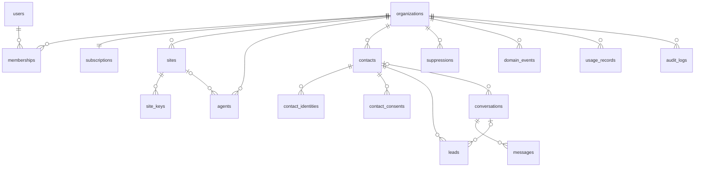

# VITIM AI — Baza de date

> Reflectă codul din `cloud/database/migrations` la versiunea **0.2.0** (Phase 1).
> Secțiunea „Proiectat, neimplementat” descrie tabelele viitoare. Ele **nu există** încă în baza de date.

## Principii

- **O bază comună, o schemă comună; `organization_id` pe fiecare tabel cu date de client.** Izolarea e impusă în model (`App\Tenancy\BelongsToOrganization`): citire filtrată automat, creare doar în organizația curentă, `organization_id` imutabil, interogare fără organizație curentă = excepție (fail closed). Un test de arhitectură pică dacă un model nou nu folosește trait-ul.
- **Migrări aditive și reversibile.** `2026_10_02_000001_phase1_foundation` rulează peste o instalare 0.1.0 și convertește datele existente:
  - rolurile: `owner→org_owner`, `manager→org_admin`, `operator→agent`, `platform_admin→super_admin`, `platform_support→vitim_admin`;
  - platforma site-urilor: `generic→custom`;
  - două coloane redenumite: `organizations.locale` și `audit_logs.target_*`.

  Verificată prin aplicare, rollback și reaplicare, pe SQLite și pe MariaDB, cu date în format 0.1.0.
- **Compatibil MySQL 5.7+/8, MariaDB 10.x, SQLite** (dezvoltare și teste). Pe cPanel: MySQL/MariaDB.
- **Date personale minime în jurnale.** `audit_logs.meta` și `domain_events.payload` conțin doar ID-uri și valori tehnice.

## Implementat (Phase 1 + Phase 2)

| Tabel | Rol | Tenant | Note |
|---|---|---|---|
| `users` | Conturi (globale) | — | `platform_role` (`super_admin`, `vitim_admin`, null) nu e fillable. `totp_secret` e criptat |
| `organizations` | Tenantul | — | `status`, `country`, `timezone`, `default_language`, `company_name`, `vat_id`. Pregătite, fără interfață: `billing_details` și `branding` (JSON) |
| `memberships` | Utilizator ↔ organizație + rol | ✓ | `org_owner`, `org_admin`, `agent`, `viewer`. Unic pe (org, user) |
| `subscriptions` | Plan, status, limite | ✓ | `trial`, `active`, `past_due`, `suspended`, `cancelled`. Limitele se copiază din `config/plans.php` |
| `sites` | Website-urile firmei | ✓ | `domain` unic global. `platform`: wordpress, woocommerce, custom, other. `verification_status`, `widget_config`, `connector_version`, `last_seen_at`, `last_sync_at` |
| `sites` (0.6.0, 0.8.0) | + `health` (JSON: starea raportată de conector), `scores` (JSON 0–100 pe categorii), `last_scan_at`, `last_audit_at` | ✓ | `last_seen_at`, `connector_version`, `verification_status` (`verified` / `mismatch`) se completează din heartbeat |
| `site_issues` (0.7.0, 0.8.0) | Problemele găsite de scanare și de audit | ✓ | Unic pe (site, `code`); `category` (security / seo / legal / updates / performance), `source` (plugin / audit), `severity`, `title`, `details`, `fix` (acțiune permisă), `status` open / resolved, prima / ultima apariție |
| `site_backups` (0.9.0) | Backup-urile raportate de plugin | ✓ | `status` ok / failed, `verified`, început / sfârșit, mărimi (bază de date, fișiere), număr de fișiere, `location` (pe hostingul clientului, doar pentru echipa VITIM), `kept`, `error` |
| `site_commands` (0.7.0) | Remedieri trimise din panou | ✓ | `action`, `target`, `status` (running / done / failed), `result`, `requested_by`, durată |
| `site_keys` | Cheia publică (widget) + secretul (plugin) | ✓ | Secretul e criptat (`APP_KEY`), cu rotație și revocare |
| `agents` | Agenții AI | ✓ | `model_configuration` și `system_configuration` (JSON validat de `AgentConfiguration`, fără secrete; include `business_facts` și `contact_line`). `template`: presetul de pornire |
| `agent_versions` | Istoricul configurației | ✓ | Un rând la fiecare schimbare de configurație (`version` crescător, cine a salvat). Append-only |
| `contacts` | Persoana (client / potențial client) | ✓ | Email și telefon **opționale**, `source`, `status`, `custom_fields` (JSON), `last_activity_at` |
| `contact_identities` | Email, telefon, WhatsApp, ID extern | ✓ | Unic pe (org, type, provider, normalized_value). Telefon E.164. Baza deduplicării și a viitorului Inbox unificat |
| `contact_consents` | Istoric de consimțământ | ✓ | **Append-only** (modificarea aruncă excepție). Canal × scop × status + sursă, IP, user agent, metadata, cine a înregistrat, când |
| `suppressions` | Liste de excludere per canal | ✓ | Doar `value_hash` (HMAC), nu adresa. Rămâne după ștergerea contactului. Motiv: `unsubscribed`, `bounced`, `complaint`, `manual`; motivul doar se agravează |
| `leads` | Oportunități | ✓ | Mai multe per contact. `status` (pipeline implicit), `intent`, `score`, `assigned_to` (membru al firmei), `summary`, valoare, `closed_at` |
| `conversations` | Fundația Inbox | ✓ | `channel` web / email / whatsapp / sms / other, `status` (`pending` = cere un om), `mode` ai/human, `assigned_to`, `is_test` (conversații din panou), `ai_cost_micro_usd` |
| `ai_turns` | Conversația cu modelul, în formatul API | ✓ | Append-only: tura asistentului se salvează completă (inclusiv blocurile de gândire) și se retrimite neschimbată |
| `tool_executions` | Jurnalul acțiunilor agentului | ✓ | `tool`, `input`, `result`, `status` (`ok`, `rejected`, `error`, `dry_run`), durată |
| `messages` | Mesaje | ✓ | `direction`, `sender_type`, `channel`, `purpose`, `status` intern, `provider`, `external_message_id`, `sent_at` / `delivered_at` / `read_at` / `failed_at` |
| `domain_events` | Outbox de evenimente | ✓ (sau null) | Scris în aceeași tranzacție cu modificarea, procesat de `vitim:events` |
| `work_logs` | Lucrările echipei VITIM pentru client | ✓ | `site_id` (opțional), `performed_by`, `performed_at`, `category`, `title`, `description`, `duration_minutes`, `visible_to_client`, `source` (manual / plugin / system), `external_ref` (unic per firmă: retrimiterile pluginului nu dublează) |
| `usage_records` | Consum zilnic per metrică | ✓ | Unic pe (org, metric, zi), incrementat atomic. Metrici AI: `ai_requests`, `ai_input_tokens`, `ai_output_tokens`, `ai_cost_micro_usd`, `ai_messages`, `conversations_started` |
| `audit_logs` | Jurnal de audit | ✓ (sau null) | `actor_user_id`, `actor_type` (user / platform / system), `action`, `entity_type`, `entity_id`, `ip`, `meta` |
| `cache`, `jobs`, `sessions`, `password_reset_tokens` | Infrastructură Laravel | — | Cache și coadă în baza de date (cPanel, fără Redis) |

### Diagrama implementată

### Valorile enumerate (în cod: `app/Enums`)

| Enum | Valori |
|---|---|
| `ContactSource` | website_ai, form, woocommerce, manual, import, email, whatsapp, sms, crm, api, ads |
| `IdentityType` | email, phone, whatsapp, external_id |
| `Channel` | web, email, whatsapp, sms, phone, other (consimțământ: email/sms/whatsapp/phone) |
| `ConsentPurpose` / `ConsentStatus` | marketing, transactional, service / granted, revoked, unknown |
| `LeadStatus` | new, contacted, qualified, proposal, won, lost |
| `LeadIntent` | buy_intent, quote_request, appointment, support, product_information, complaint, human_request, other |
| `MessageStatus` | queued, sent, delivered, read, failed, bounced, cancelled, received |
| `SenderType` | contact, ai, human, system |

## Proiectat, neimplementat (fazele următoare)

Tabelele de mai jos sunt proiectate să se lege de schema existentă fără restructurări: toate au `organization_id` și refolosesc `contacts`, `contact_identities`, `contact_consents`, `suppressions`, `messages` și `domain_events`.

| Tabel | Scop | Legături | Fază |
|---|---|---|---|
| `knowledge_sources` / `knowledge_documents` / `knowledge_chunks` | Informațiile firmei pentru agent (RAG) | agents | Faza 3 |
| `integrations` (+ `credentials_enc`) | Conexiuni externe (webhook, WooCommerce, Google...) | organizations | Faza 5+ |
| `tags`, `contact_tag` | Etichete de contact (segmentare, automatizări) | contacts | cu Segmentele |
| `segments` | Definiție JSON de filtre (ex. „consimțământ WhatsApp” + „lead fără răspuns 3 zile”), evaluată în SQL la rulare | contacts, identities, consents, leads, messages | Marketing |
| `message_templates` | name, channel, language, subject, content, `variables` (listă), status (draft/approved) | organizations | Marketing |
| `campaigns` | name, type, status (DRAFT → SCHEDULED → RUNNING → PAUSED/COMPLETED/CANCELLED), segment_id, channel, template_id, scheduled/started/completed_at, **approved_by / approved_at** | segments, templates | Marketing |
| `campaign_recipients` | campaign_id, contact_id, message_id, status, motivul excluderii (fără consimțământ, suprimat) | campaigns, contacts, messages | Marketing |
| `automation_workflows` | Definiție versionată: noduri TRIGGER / CONDITION / WAIT / EMAIL / WHATSAPP / SMS / AI / WEBHOOK / CREATE_LEAD / CREATE_TASK / UPDATE_CONTACT / ADD_TAG / REMOVE_TAG / HUMAN_TASK / STOP | organizations | Automatizări |
| `automation_runs` | Instanța unui flux pentru un contact: nodul curent, `wake_at` (pentru WAIT), status | workflows, contacts | Automatizări |
| `automation_events` | Istoricul pașilor unui run (auditabil) | runs | Automatizări |
| `tasks` | Sarcini pentru oameni (CREATE_TASK, HUMAN_TASK) | contacts, leads, users | CRM light |
| `appointments` | Programări (Google Calendar) | contacts, sites | Programări |

**Cum se leagă automatizările de fundația existentă.** Un eveniment din `domain_events` (de exemplu `lead.created`) este livrat de `vitim:events` către un `DomainEventListener`. Acesta pornește `automation_runs`. Nodurile WAIT sunt reluate de scheduler prin `wake_at`. Nodurile de mesaj trec exclusiv prin `MessagingService`, deci consimțământul și suprimările se aplică automat.
